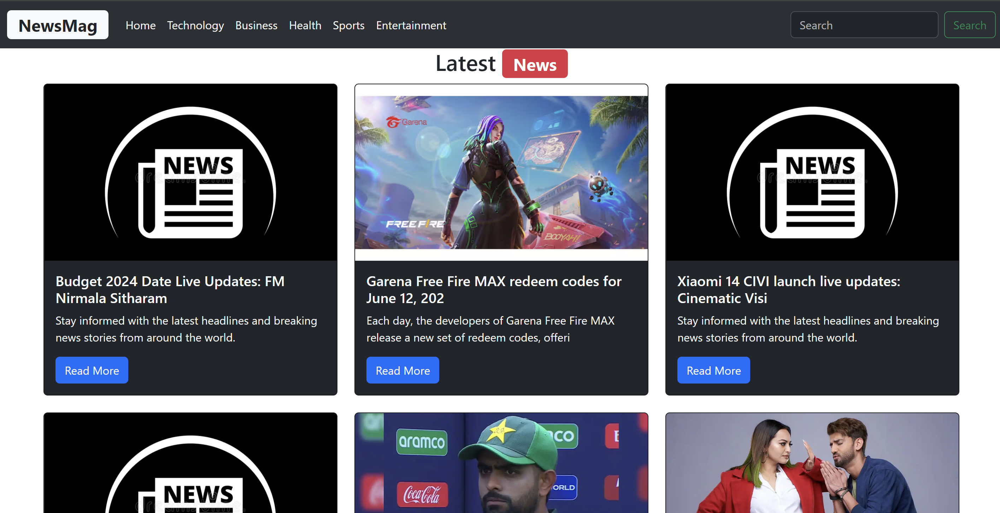

# News Mag React App

## Description

News Mag is a responsive web application built with React and Bootstrap that fetches and displays latest news headlines using the NewsAPI. It provides users with up-to-date news articles categorized by different topics.

## Features

- Fetches news articles using the NewsAPI.
- Responsive design using Bootstrap for optimal viewing on various devices.
- Clickable news items that direct users to the full article.
- Categorized news sections for easy navigation.

## Deployed Application

Check out the live deployment of the News Mag React App:

[News Mag React App](https://react-app-newsmag.vercel.app/)
